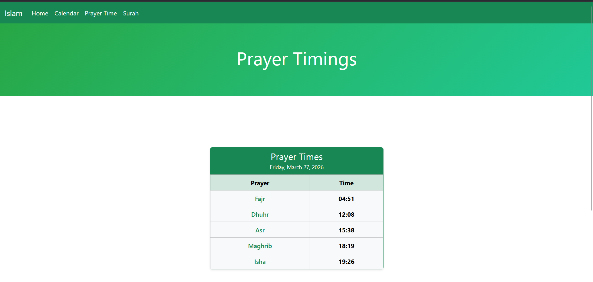
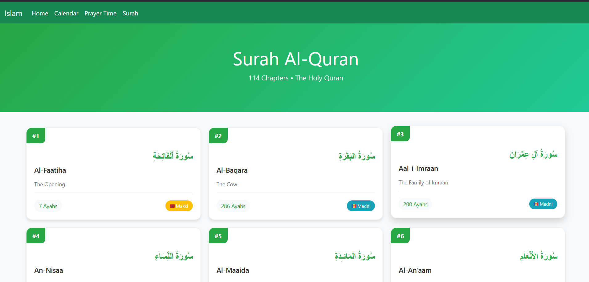
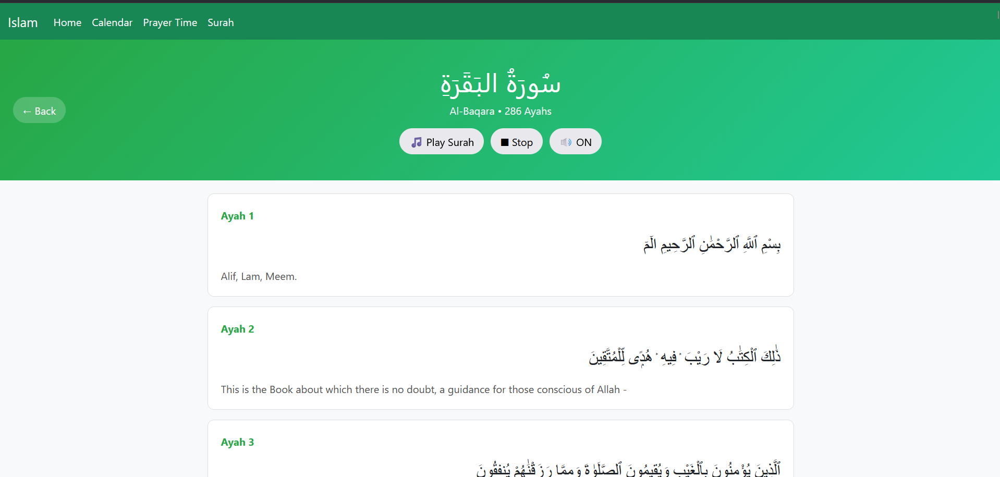

# 📖 Islamic Quran Application

A comprehensive Islamic web application built with React that provides Quran reading, prayer times, Islamic calendar, and more. The app features a beautiful UI with audio recitation, translations, and responsive design.

## 🌟 Features

### 📚 Quran Module
- **Complete Quran** with all 114 Surahs
- **Arabic Text** with Uthmani script
- **English Translation** (Saheeh International)
- **Audio Recitation** by Sheikh Alafasy
- **Ayah-by-Ayah** navigation with individual audio playback
- **Responsive Grid** layout for Surah listing

### 🕌 Prayer Times
- Daily prayer timings (Fajr, Dhuhr, Asr, Maghrib, Isha)
- Next prayer indicator
- Current date display
- Modern card-based design

### 📅 Islamic Calendar
- Gregorian to Hijri date conversion
- Interactive calendar view
- Important Islamic events and dates
- Month navigation

### 🏠 Home Page
- Hero image section
- Statistics cards showing:
  - Total Paras (30)
  - Total Surahs (114)
  - Total Ayats (6666)

## 🚀 Live Demo

[Add your deployed link here once available]

## 🛠️ Technologies Used

- **React.js** - Frontend framework
- **React Router DOM** - Navigation and routing
- **Bootstrap 5** - Styling and responsive design
- **AlQuran Cloud API** - Quran data and translations
- **AlAdhan API** - Prayer times and Islamic calendar
- **CSS3** - Custom styling and animations

## Home
.png)
</br>
.png)

## Calender
.png)
</br>
.png)

## Prayer Time


## Surah


## Ayat


## 📦 Installation

### Prerequisites
- Node.js (v14 or higher)
- npm or yarn package manager

### Steps to Run Locally

1. **Clone the repository**
```bash
git clone https://github.com/yourusername/islamic-quran-app.git
cd islamic-quran-app
